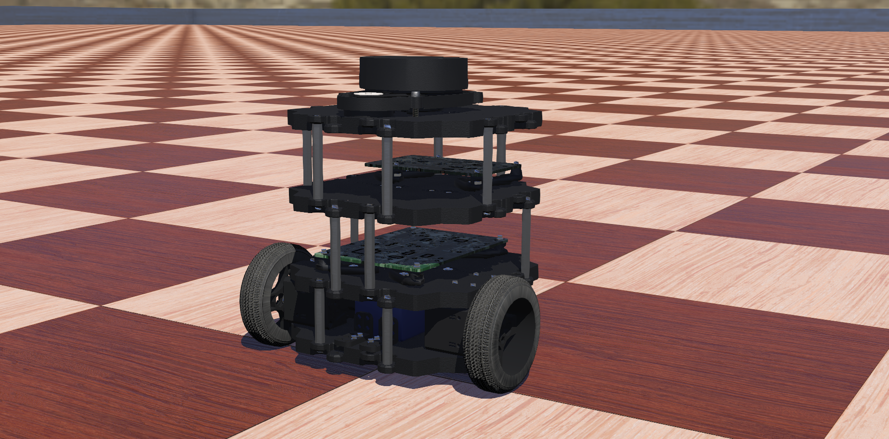

# webots_ros_PythonRobotics
Implement [PythonRobotics](https://github.com/AtsushiSakai/PythonRobotics) on TurtleBot3 in Webots

# Requirements
* [ROS](http://wiki.ros.org/ROS/Installation)
* [Webots](https://cyberbotics.com/)
* Python packages:
    
    ```pip install -r requirements.txt```
# Table of Contents
* [Localization](catkin_ws/src/localization)
  
    * [Extended Kalman filter](catkin_ws/src/localization/scirpts/ekf)
    
    * [Unscented Kalman filter](catkin_ws/src/localization/scirpts/ukf)
    
    * [Histogram filter](catkin_ws/src/localization/scirpts/histogram_filter)
    
    * [Particle filter](catkin_ws/src/localization/scirpts/particle_filter)
    
# How to Use
1. Git clone

    ```git clone https://github.com/virtualclone/webots_ros_PythonRobotics```
2. catkin_make
    
    ```cd catkin_ws && catkin_make```
3. Running the nodes (you can check detailed introductions in each section listed in the table of contents)