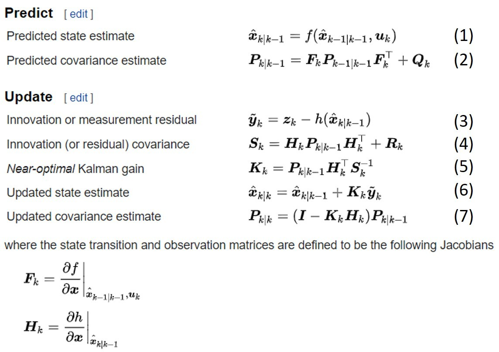

# Extended Kalman Filter
EKF is a nonlinear version of Kalman filter by linearizing the system dynamics.

If you don't understand EKF, I recommend reading these materials:

* [Understanding Kalman Filters (MathWorks)](https://www.mathworks.com/videos/series/understanding-kalman-filters.html)

* [Extended Kalman filter (wiki)](https://en.wikipedia.org/wiki/Extended_Kalman_filter)

# Algorithm
These equation labellings can map to code.

[ekf_estimation](https://github.com/virtualclone/webots_ros_PythonRobotics/blob/main/catkin_ws/src/localization/scirpts/ekf/ekf.py#L116-L130)
