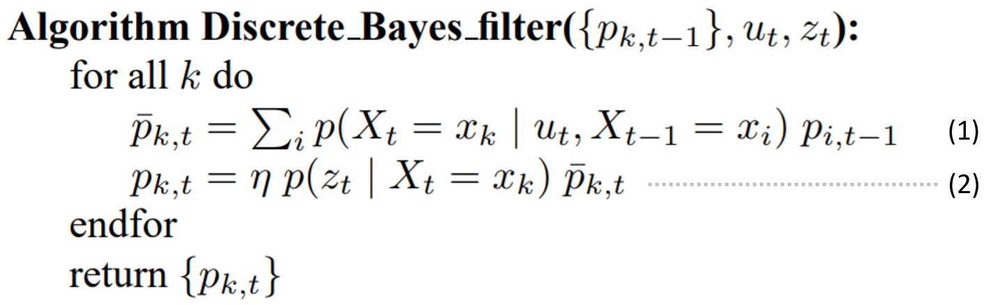

# Histogram Filter
Histogram filters decompose the state space into finitely many regions, and represent the cumulative posterior for each region by a single probability value.

If you don't understand histogram filters, I recommend reading these materials:

* [Robot Localization II: The Histogram Filter](https://www.sabinasz.net/robot-localization-histogram-filter/)

* [Probabilistic Robotics](https://docs.ufpr.br/~danielsantos/ProbabilisticRobotics.pdf)

    * 2.4 Bayes Filters (p.23)
    * 4.1 The Histogram Filter (p.68)

# Algorithm
These equation labellings can map to code.

[histogram_filter_localization](https://github.com/virtualclone/webots_ros_PythonRobotics/blob/main/catkin_ws/src/localization/scirpts/histogram_filter/histogram_filter.py#L56-L60)

# Note
There are 4 landmarks (yellow box) which are known for Turtlebot3.

You can dynamically move them and they will also be updated in rviz.

The estimated grid map are represented as white points.

The result will be better when TurtleBot3 gets closer to those landmarks.

The blue line indicates that TurtlbBot3 can sense those landmarks.

