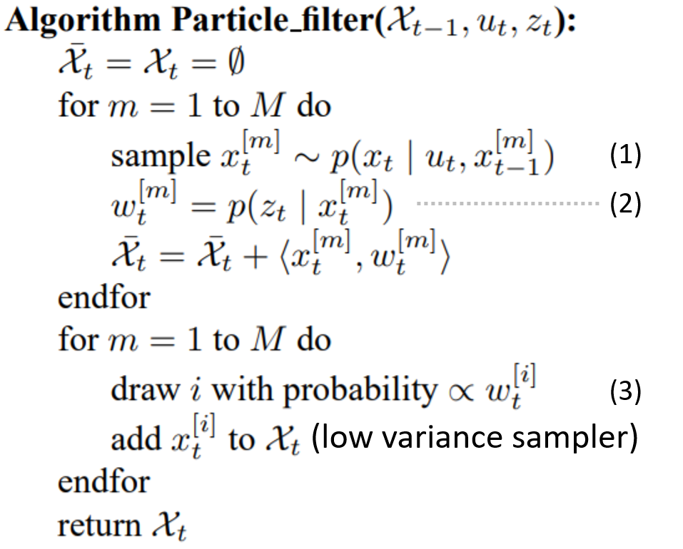
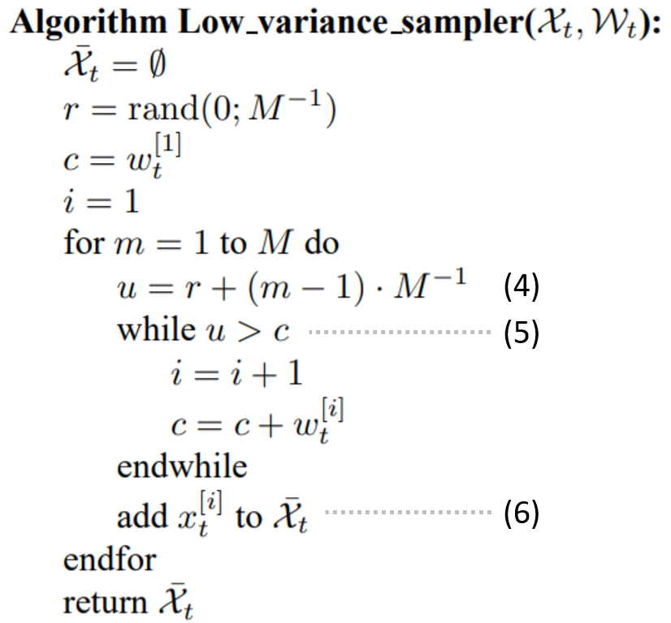

# Particle Filter
Particle filter decompose the state space into finitely points (particles), and represent the cumulative posterior for each point multiplied by a weight.

If you don't understand particle filter, I recommend reading these materials:

* [Probabilistic Robotics](https://docs.ufpr.br/~danielsantos/ProbabilisticRobotics.pdf)

    * 2.4 Bayes Filters (p.23)
    * 4.2 The Particle Filter (p.77)
    
# Algorithm
These equation labellings can map to code.

[pf_localization](https://github.com/virtualclone/webots_ros_PythonRobotics/blob/main/catkin_ws/src/localization/scirpts/particle_filter/particle_filter.py#L113-L146)

[re_sampling](https://github.com/virtualclone/webots_ros_PythonRobotics/blob/main/catkin_ws/src/localization/scirpts/particle_filter/particle_filter.py#L148-L167)

# Note
There are 4 landmarks (yellow box) which are known for Turtlebot3.

You can dynamically move them and they will also be updated in rviz.

The estimated particles are represented as white points.

The blue line indicates that TurtlbBot3 can sense those landmarks.
