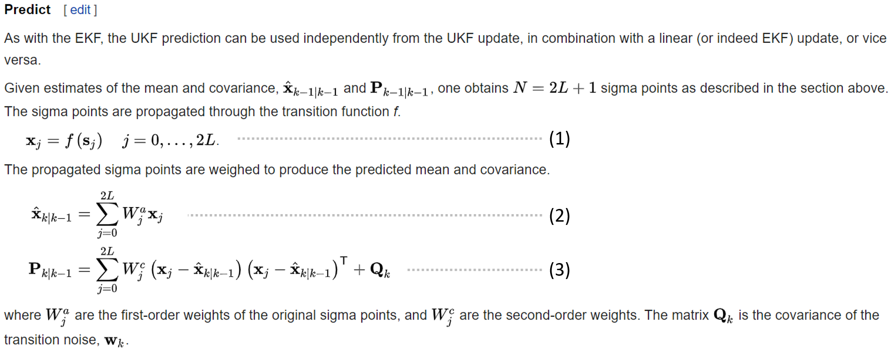
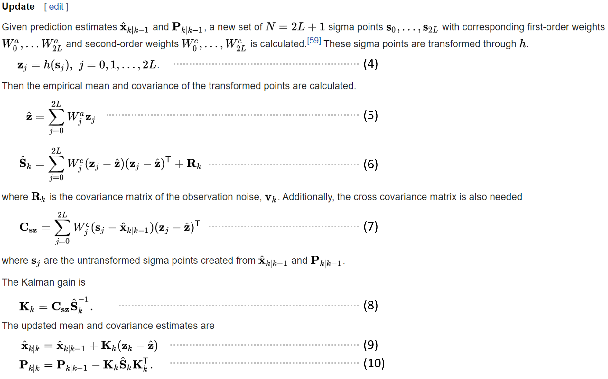

# Unscented Kalman Filter
UKF is a nonlinear version of Kalman filter by using a deterministic sampling technique known as the unscented transformation (UT).

If you don't understand UKF, I recommend reading these materials:

* [Understanding Kalman Filters (MathWorks)](https://www.mathworks.com/videos/series/understanding-kalman-filters.html)

* [Unscented Kalman filter (wiki)](https://en.wikipedia.org/wiki/Kalman_filter#Unscented_Kalman_filter)

* [The Unscented Kalman Filter for Nonlinear Estimation (paper)](https://www.seas.harvard.edu/courses/cs281/papers/unscented.pdf)

# Algorithm
These equation labellings can map to code.

[ukf_estimation](https://github.com/virtualclone/webots_ros_PythonRobotics/blob/main/catkin_ws/src/localization/scirpts/ukf/ukf.py#L153-L174)

